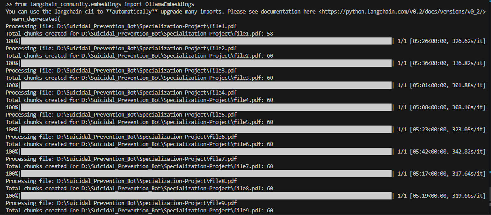
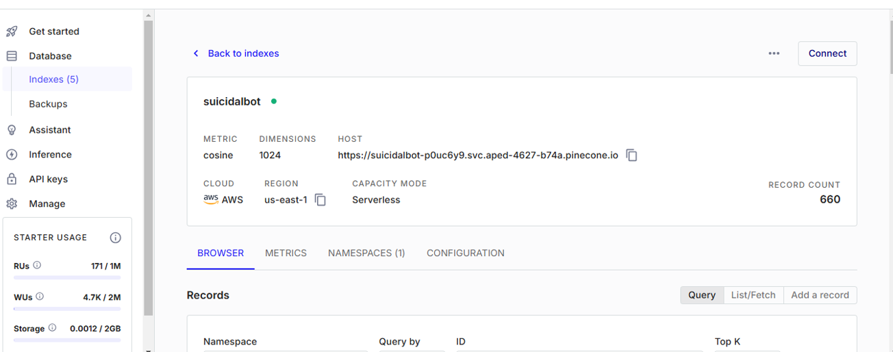
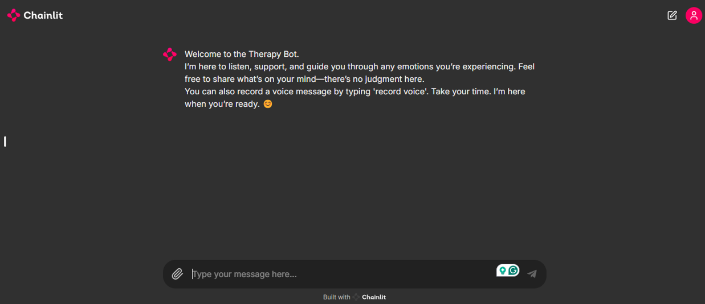
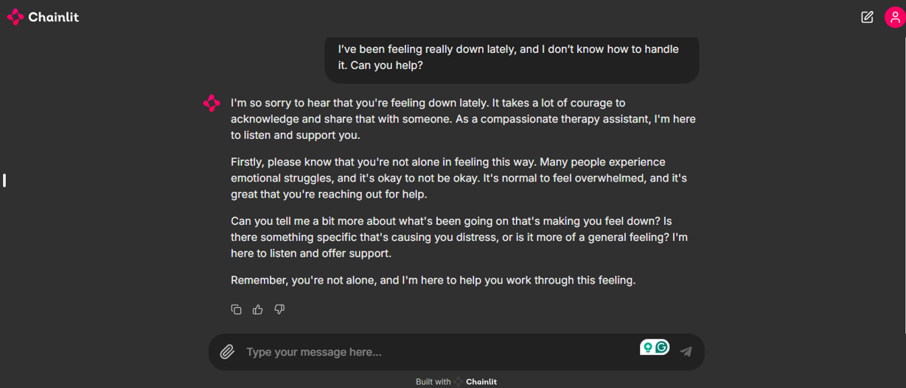
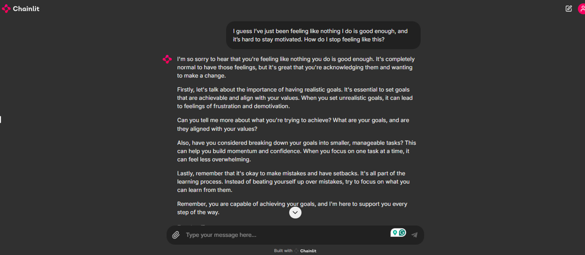
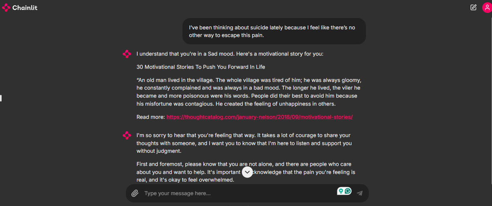
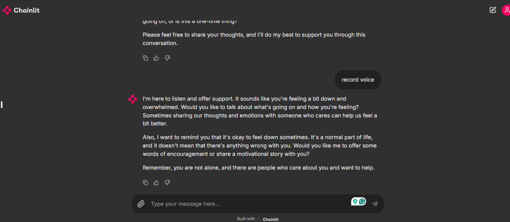
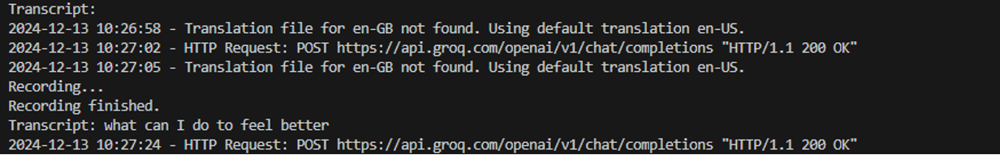

# Suicide Prevention Bot
## Abstract
In recent times, we see an increase in mental health issues, and a critical need for accessing support systems should be made available to individuals who are hesitant to share their mental situation aspects with their parents or friends.
The Suicide Prevention Therapy ChatBot uses advanced LLMs to provide empathetic crisis support and initial therapeutic advice. It’s designed for natural, human-like interaction, serving as a first-contact support system for individuals hesitant to seek help, addressing the urgent need for accessible mental health care.


## Introduction

In recent times, we see an increase in mental health issues, and a critical need for accessing support systems should be made available to individuals who are hesitant to share their mental situation aspects with their parents or friends.
The Suicide Prevention Therapy ChatBot uses advanced LLMs to provide empathetic crisis support and initial therapeutic advice. It’s designed for natural, human-like interaction, serving as a first-contact support system for individuals hesitant to seek help, addressing the urgent need for accessible mental health care.


## objective
- Increase accessibility to mental health support.
- Promote mental well-being and reduce stigma associated with seeking help.
- Reduce suicide attempts through timely intervention.

This project uses the following technologies:
- **Python** for backend logic.
- **LangChain** for NLP-based queries.
- **Pinecone** for vector storage.
- **Google Speech-to-Text API** for voice transcriptions.
- **TextBlob** for mood detection.
- **Chainlit** for chatbot interactions.

## Table of Contents
1. [Features](#features)
2. [Setup](#setup)
3. [Project Structure](#project-structure)
4. [Models and APIs Used](#models-and-apis-used)
5. [How It Works](#how-it-works)
6. [Screenshots](#screenshots)
7. [Requirements](#requirements)
8. [License](#license)

## Features

- **Compassionate Therapy Assistant:** Provides empathetic responses based on the emotional tone of user interactions.
- **Voice Message Support:** Records and transcribes voice inputs.
- **Mood Detection:** Analyzes user messages to determine mood (happy, sad, or neutral).
- **Motivational Stories:** Fetches motivational stories based on detected mood.
- **Geolocation Tracking:** Captures geolocation data to notify in emergencies.
- **Suicide Detection and Notification:** Sends email alerts with relevant conversation and location data.

---

## Setup

Follow these steps to set up and run the project:

### Clone the Repository

```bash
git clone https://github.com/arunkumar-116/suicide-prevention-bot.git
cd suicide-prevention-bot
```

## 🛠️ Tech Stack
- **Programming Language**: Python
- **Libraries**:
  - LangChain
  - Pinecone
  - Google Cloud Speech-to-Text
  - Chainlit
  - TextBlob
  - Requests
- **Environment**: Python 3.10+

##  Create a virtual environment and activate it

```bash
python -m venv venv
source venv/bin/activate    # On Windows: venv\Scripts\activate
```

## Install the dependencies
```bash
pip install -r requirements.txt
```
## Set up environment variables
Create a .env file in the root directory.
Add the following variables:
```plaintext
GEOLOCATION_API_KEY=your_geolocation_api_key
BING_API=your_bing_api_key
SMTP_USERNAME=your_email_username
SMTP_PASSWORD=your_email_password
```
## Set up Google Cloud credentials
Download the service account JSON key from your Google Cloud Console.
Save it in the root directory and update the path in bot2.py


## Project Structure📂
```plaintext
├── embedding.py         # Creates embeddings from PDF files
├── bot2.py              # Implements the therapy bot
├── requirements.txt     # List of dependencies
├── README.md            # Project documentation
└── images/              # Images used in README (if any)
```
## Models and APIs Used
1. **LangChain:**
   -LangChain is used for handling the Natural Language Processing (NLP) part of the chatbot. It helps the bot understand user queries and generate appropriate responses based on the conversation context.

   -LangChain facilitates the interaction between the bot and the various models, enabling dynamic conversation handling and improving the overall user experience.

2. **Pinecone:**
   -Pinecone is used for vector-based storage and search. The system creates embeddings for PDF documents that can be queried by the chatbot to fetch relevant information when needed. This helps the bot respond with context-specific information, improving the accuracy of its responses.
3. **Google Speech-to-Text API:**
   -The Google Speech-to-Text API is integrated into the bot to handle voice messages. It converts spoken words into text, allowing the user to interact with the bot through voice instead of just typing. This makes the chatbot more accessible to a larger audience.
   -The API converts speech to text in real-time, enhancing the chatbot’s functionality, especially in emergency or crisis situations.

4. **TextBlob:**
   -TextBlob is used for sentiment analysis to detect the user's mood based on their input. The bot analyzes the sentiment of the message to understand if the user is feeling sad, happy, or neutral, and responds accordingly.
   -This helps the bot detect emotional distress, an important feature for identifying when a user may be at risk.

5. **SMTP:**
   -The SMTP (Simple Mail Transfer Protocol) service is used to send email notifications. When the bot detects certain crisis indicators or suicide-related keywords, it sends an email alert to a specified email address with details of the conversation and the user's geolocation.
   -This ensures timely intervention by relevant parties such as mental health professionals or loved ones.

6. **Geolocation API:**
   -The Geolocation API is used to track the user's location when necessary, especially in cases of emergency. The bot can use this information to provide more accurate notifications to relevant authorities or loved ones.


   
## How It Works
1. **PDF Processing:**
   - The `embedding.py` script processes multiple PDF files, splits them into chunks, and creates embeddings using Pinecone.

2. **User Interaction:**
   - The chatbot (`bot2.py`) handles user inputs, both text and voice, via Chainlit.

3. **Mood Analysis:**
   - Mood is detected using TextBlob's sentiment analysis. Based on the mood, the bot fetches motivational stories.

4. **Emergency Notifications:**
   - If suicide-related keywords are detected, an email with the conversation and geolocation is sent to a specified contact.


## Screenshots

- **Embedding Creation:**
  

- **Pinecone Database:**
  

- **Starting-page**
  

- **Query-1:**
  

- **Query-2:**
  

- **Query-3:**
  

- **record-voice**
  

- **Transcript**
  


## Conclusion

The Suicide Prevention Chatbot aims to provide a timely and compassionate support system for individuals facing emotional distress. By leveraging advanced AI, NLP, and crisis detection techniques, it ensures users receive personalized, empathetic responses. Through features like voice support, mood detection, and emergency notifications, this chatbot serves as a vital tool for improving mental health accessibility.

The future scope offers opportunities for enhancing user interaction and expanding the system’s capabilities, making it a crucial addition to mental health support strategies.


## MIT License

Copyright (c) 2025 Arun Kumar (arunkumardsp001@gmail.com)

Permission is hereby granted, free of charge, to any person obtaining a copy
of this software and associated documentation files (the "Software"), to deal
in the Software without restriction, including without limitation the rights
to use, copy, modify, merge, publish, distribute, sublicense, and/or sell
copies of the Software, and to permit persons to whom the Software is
furnished to do so, subject to the following conditions:

The above copyright notice and this permission notice shall be included in all
copies or substantial portions of the Software.

THE SOFTWARE IS PROVIDED "AS IS", WITHOUT WARRANTY OF ANY KIND, EXPRESS OR
IMPLIED, INCLUDING BUT NOT LIMITED TO THE WARRANTIES OF MERCHANTABILITY,
FITNESS FOR A PARTICULAR PURPOSE AND NONINFRINGEMENT. IN NO EVENT SHALL THE
AUTHORS OR COPYRIGHT HOLDERS BE LIABLE FOR ANY CLAIM, DAMAGES OR OTHER
LIABILITY, WHETHER IN AN ACTION OF CONTRACT, TORT OR OTHERWISE, ARISING FROM,
OUT OF OR IN CONNECTION WITH THE SOFTWARE OR THE USE OR OTHER DEALINGS IN
THE SOFTWARE.


